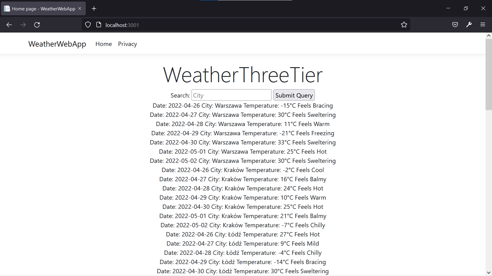
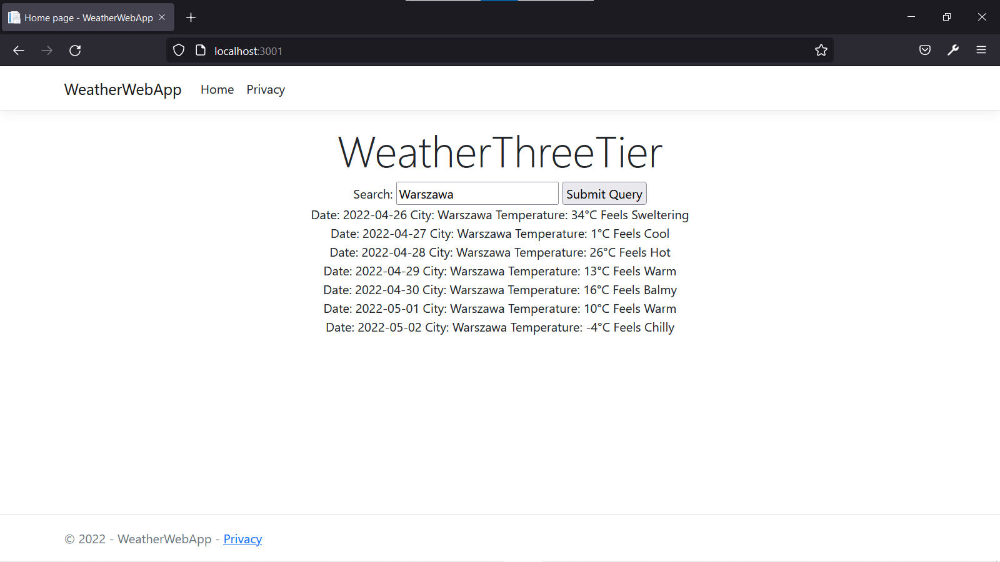

# WeatherThreeTier

Solution includes 4 projects:

- WeatherModels

	*Not a ThreeTier architecture component.* Library for storing and reading data about weather forecasts

- WeatherRepository

	Repository is a component for centralized storage of weather data

- WeatherREST

	Is a service for web application, providing search functionality (through HTTP query param, for example `?city=warszawa`)

- WeatherWebApp

	Application which can be opened in browser. It contains Index page which displays search field and all forecasts.

	

    Data diplayed here: Date, City, Temperature in Celsius and summary (how it feels)
    `Date: 2022-04-29 City: Warszawa Temperature: 13°C Feels Warm`

	Type in the search city name (can be Warszawa, Kraków, Łódź, Wrocław, Poznań, Gdańsk, Szczecin, Bydgoszcz, Lublin, Białystok) and obtain forecasts for specific city:

    
    
    Cities are seeded in [Repository source file](./WeatherRepository/Repositories/Repository.cs):

	```CSharp
	private void SeedCities()
    {
        var cities = new[]
        {
            "Warszawa",
            "Kraków",
            "Łódź",
            "Wrocław",
            "Poznań",
            "Gdańsk",
            "Szczecin",
            "Bydgoszcz",
            "Lublin",
            "Białystok"
        };

        foreach (var city in cities)
        {
            Cities.Add(new City(city));
        }
    }
	```

    Forecasts are seeded for 7 days from today, see [Repository source file](./WeatherRepository/Repositories/Repository.cs)

    ```CSharp
    public void Seed()
    {
        if (!seeded)
        {
            SeedCities();
            SeedForecasts(7);
            seeded = true;
        }
        .
        .
        .
    ```
